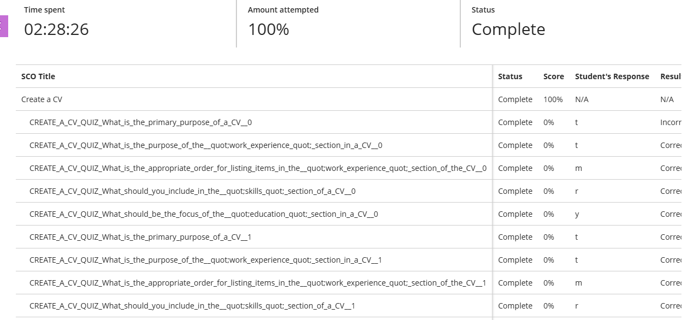
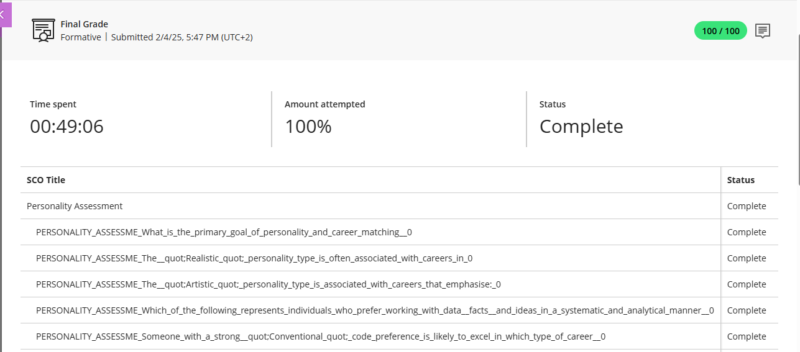
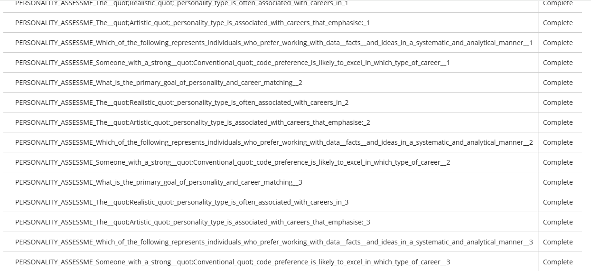
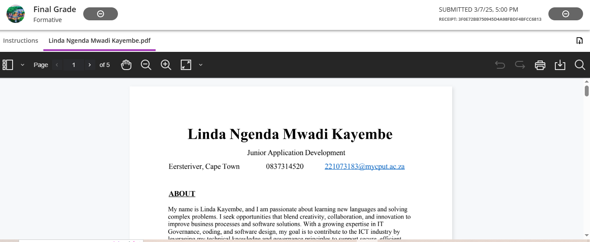

# 🌟 PRP370S Digital Portfolio – Work Readiness Module

**Name:** Linda Ngenda Mwadi Kayembe  
**Student Number:** 221073183  
**Module:** Project Presentation 3 (PRP370S)  
**Lecturer:** P. Inderlal  
**Date:** May 2025  
**Qualification:** Diploma in Information and Communication Technology  

---

## 📚 Table of Contents

1. [Career Counselling](#1-career-counselling)
2. [Skills and Interests](#2-skills-and-interests)
3. [Personality Assessment](#3-personality-assessment)
4. [Create a CV](#4-create-a-cv)
5. [CV Submission](#5-cv-submission)
6. [Mock Interview Video](#6-mock-interview-video)

---

ABOUT Me

My name is Linda Kayembe, and I am passionate about learning new languages and solving
complex problems. I seek opportunities that blend creativity, collaboration, and innovation to
improve business processes and software solutions. With a growing expertise in IT
Governance, coding, and software design, my goal is to contribute to the ICT industry by
leveraging my technical knowledge and governance principles to support secure, efficient,
and compliant technology environments. I thrive in roles that challenge me to drive impactful
change and continuous improvement.

### 1. Career Counselling

### ✅ Evidence  

### 💬 Reflection (STAR Technique)  
**S**ituation: I was unsure which ICT career path to pursue after graduation.  
**T**ask: I had to explore career options and create a career development plan.  
**A**ction: I completed the career counselling quiz and activities, identified my core goals, values, and action plan using the SMART technique.  
**R**esult: I discovered that I’m best suited for roles like Business Analyst or IT Project Manager and now have a clear career plan to achieve them.

---

## 2. Skills and Interests

### ✅ Evidence  

### 💬 Reflection (STAR Technique)  
**S**ituation: I needed to identify what skills and interests align with a fulfilling ICT career.  
**T**ask: Complete self-assessments on adaptive, technical, and transferable skills, and map out vocational interests.  
**A**ction: I reflected on my top skills like analytical thinking, communication, and organization. My interest areas were **Social**, **Conventional**, and **Investigative**.  
**R**esult: I realized I thrive in roles involving problem-solving, structure, and people—ideal for careers in IT consulting or systems support.

---

## 3. Personality Assessment

### ✅ Evidence  
  

### 💬 Reflection (STAR Technique)  
**S**ituation: I wanted to understand how my personality influences my career fit.  
**T**ask: Take the MBTI and DISC personality tests to assess strengths and preferences.  
**A**ction: I completed both quizzes and learned that I am likely an INFJ/ISFJ type—organized, purpose-driven, and empathetic.  
**R**esult: This aligns with roles where I lead with structure and purpose, such as team lead, educator, or UX analyst.

---

## 4. Create a CV

### ✅ Evidence  
- [CV REVIEW.docx](./CV%20REVIEW.docx) – Original CV  
- [CV REVIEWs.docx](./CV%20REVIEWs.docx) – Updated CV after feedback  
- 

### 💬 Reflection (STAR Technique)  
**S**ituation: My initial CV lacked professional formatting and key information.  
**T**ask: I had to revise my CV to meet industry standards using feedback and best practices.  
**A**tion: I included relevant sections (education, experience, skills) and improved layout and grammar.  
**R**esult: I now have a polished CV that highlights my achievements and is ready to submit for internships and job applications.

---

## 5. CV Submission

### ✅ Evidence  

### 💬 Reflection (STAR Technique)  
**S**ituation: As part of my course, I was required to submit a final professional CV.  
**T**ask: Ensure the correct and updated CV was submitted through the appropriate platform.  
**A**ction: I confirmed my document version, followed upload instructions, and submitted before the deadline.  
**R**esult: I successfully submitted my CV on time and gained practical experience preparing job applications.

## 6. Mock Interview Video

### ✅ Evidence  
🎥 [Watch Mock Interview – Linda.mp4](./Linda.mp4)

### 💬 Reflection (STAR Technique)  
**S**ituation: I had never practiced for a real job interview before.  
**T**ask: Record a mock interview video to simulate a real ICT job interview experience.  
**A**tion: I researched common interview questions, dressed professionally, and practiced my delivery before recording.  
**R**esult: I improved my confidence, body language, and verbal communication, and I now feel more prepared for real-life interviews.

## ✅ Final Reflection

This portfolio represents my complete journey through the Work Readiness module. From assessing my career options to building a professional CV and practicing interview skills, I’ve grown in confidence, clarity, and career preparedness. I’m now ready to take the next step in the ICT industry.

Thank you for viewing my portfolio!
